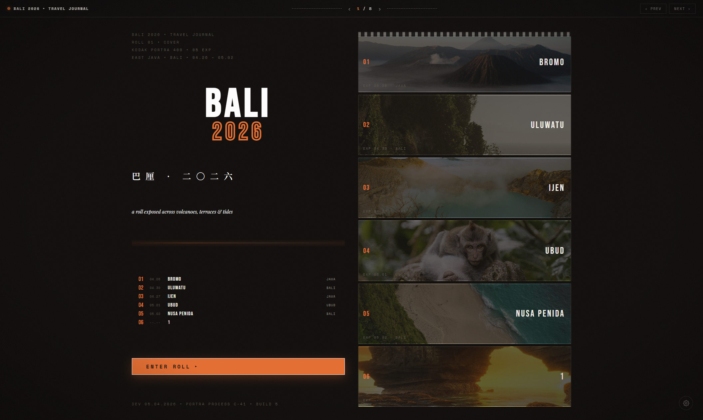

# BALI 2026 · 巴厘岛摄影相册



一本可交互的巴厘岛旅行摄影册：封面章节导航 → 五个章节故事页（布罗莫 / 乌鲁瓦图 / 伊真 / 乌布 / 努萨佩尼达）→ 统计尾页，附带照片管理、照片裁剪与文字/样式实时配置的后台。

## 功能

- **相册浏览**：封面索引导航、胶片颗粒质感、章节故事页、统计尾页
- **照片查看**：全幅照片 + 胶片式缩略图导航，点击查看原图，逐张裁剪（焦点 / 缩放）
- **照片管理**（`admin.html`）：批量上传、删除、页面增删改、重命名
- **文字与样式配置**（`text.html`）：9 类文字元素独立颜色控制、文字实时编辑、侧栏实时预览 + 完整视图模式

## 技术栈

Vite 6 · React 19 · Node.js（零依赖静态服务 + JSON API）

## 快速开始

```bash
cd web
npm install
npm run build     # 生成 ../bali-album/vite-assets/（构建产物不入库）
cd ..
node server.js   # 启动服务，零依赖
```

浏览器打开 <http://localhost:8123>

| 入口 | 说明 |
| --- | --- |
| `/index.html` | 相册本体 |
| `/admin.html` | 照片管理 |
| `/text.html` | 文字与样式配置 |

## 目录结构

```
├── server.js            # 静态服务 + API（Node 零依赖）
├── web/                 # 前端源码（Vite + React）
│   └── src/             # 组件、样式、数据、API
├── bali-album/          # 构建产物 + 数据文件（vite build 生成）
│   ├── assets/          # 封面 / 尾页素材
│   └── *.json           # 页面、裁剪、封面文案数据
├── photos/              # 章节封面缩略图
└── photos2/<章节>/      # 各章节照片（管理界面维护）
```

## 数据文件（由管理界面自动维护，勿手改）

- `bali-album/pages.json` — 页面清单与配置
- `bali-album/photos-crop.json` — 照片裁剪参数
- `bali-album/coverfin.json` — 封面 / 尾页文案

## 说明

- `bali-album/vite-assets/` 为构建产物，已通过 `.gitignore` 排除，`npm run build` 可随时重新生成
- `web/node_modules/` 不入库，`npm install` 安装
- 照片裁剪、页面文案等均通过管理界面操作，数据保存在 `bali-album/*.json`
